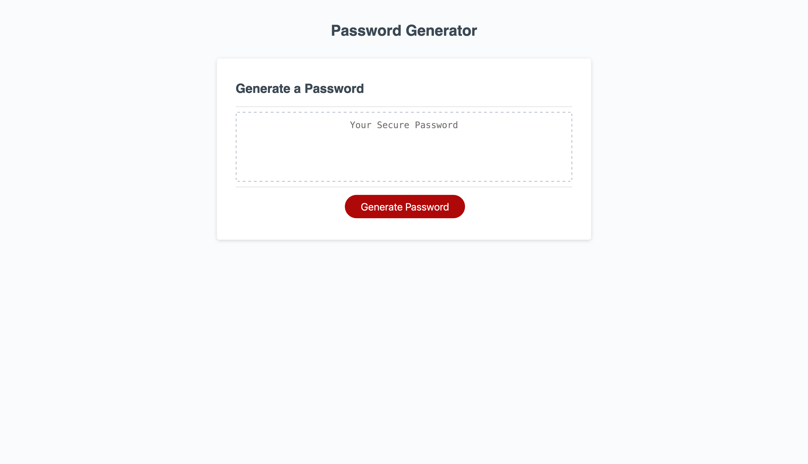

# 
This password generator creates a random password based on selected user criteria. User can choose a password between 8-128 characters. Must include at least one character type (ie: lowercase, uppercase, numeric, and/or special characters).

## 
https://yyb613.github.io/password-generator/

