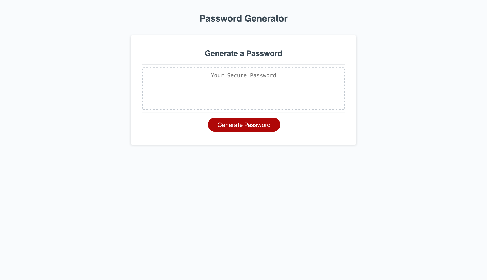

# Password Generator

## Description
This password generator creates a random password based on selected user criteria. User can choose a password between 8-128 characters. Must include at least one character type (ie: lowercase, uppercase, numeric, and/or special characters).

## License

  
This project is licensed under the MIT License.

For more information on this license, please visit [their website](https://www.mit.edu/~amini/LICENSE.md).

## Deployment
[Deployment Link](https://yyb613.github.io/password-generator)

## Contact
If you have any questions, you can find me [here](https://yyb613.github.io/portfolio).
